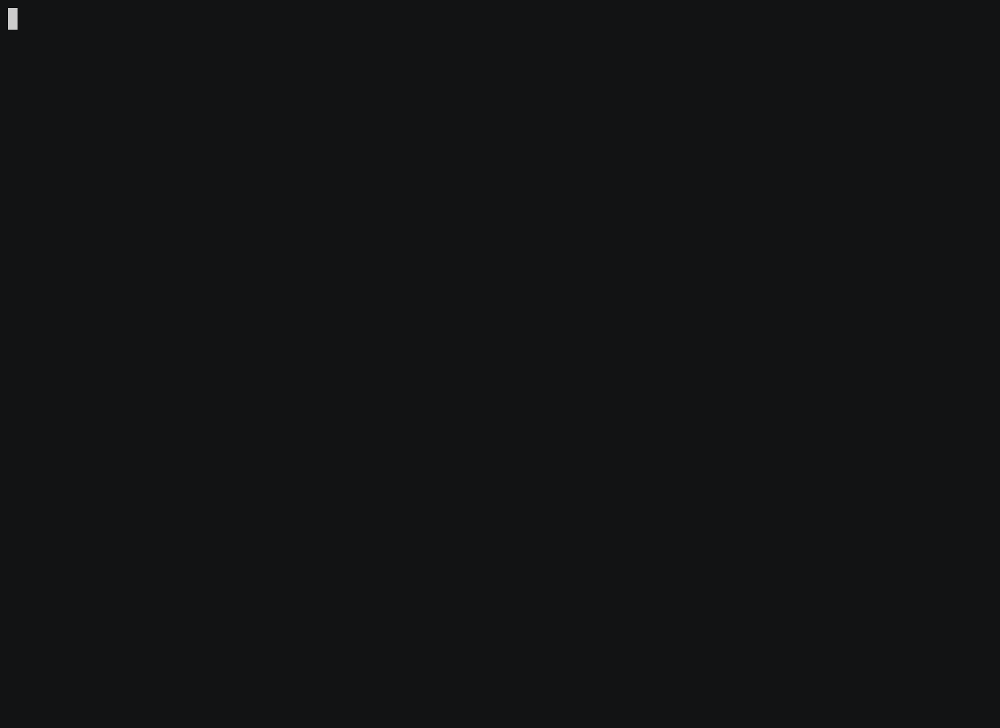

# Sum

## Running

```
docker run --rm sum 4 2
```

## Automated build, tag and push

Remember to export your DockerHub username to `DOCKER_USERNAME`

```
./push.sh sum
```

<center></center>
<!--

-->

## Building

```
docker build -t sum .
```

<center></center>

## Tagging

Remember to export your DockerHub username to `DOCKER_USERNAME`

```
docker tag sum $(echo $DOCKER_USERNAME)/sum
```

<center></center>

## Pushing

```
docker push $(echo $DOCKER_USERNAME)/sum
```

<center></center>
